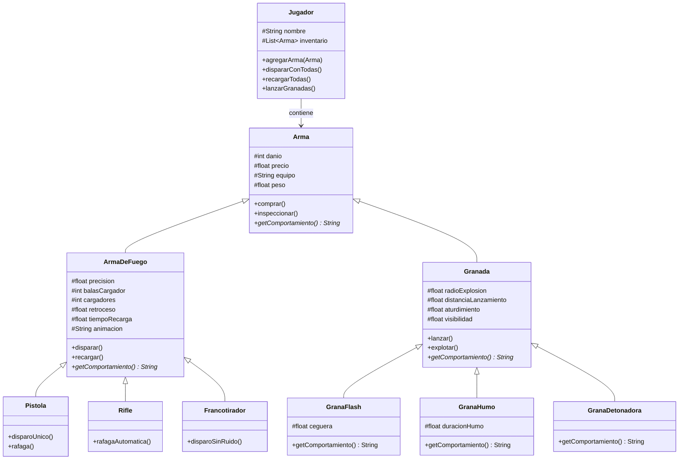

# LT-taller-git-2026

API REST de modelado de armas de Counter-Strike 2, implementada con Spring Boot. Demuestra los principios de herencia, polimorfismo y ocultamiento de información.

## Objetivo

Publicar un servicio HTTP que versiona el modelado de clases con herencia, sobreescritura y ocultamiento de la información, aplicado al dominio de armas de Counter-Strike 2.

## Arquitectura

### Jerarquía de Clases



## Endpoints

### IndexController
- `GET /` — Retorna un saludo inicial

### ArmaController
- `GET /arma/pistola?danio=25&precio=500&...` — Crea y retorna una Pistola en JSON
- `GET /arma/rifle?danio=77&precio=2100&...` — Crea y retorna un Rifle en JSON
- `GET /arma/francotirador?danio=115&precio=4750&...` — Crea y retorna un Francotirador en JSON
- `GET /arma/granada-flash?danio=0&precio=200&...` — Crea y retorna una Granada Flash en JSON
- `GET /arma/granada-humo?danio=0&precio=300&...` — Crea y retorna una Granada Humo en JSON
- `GET /arma/granada-detonadora?danio=60&precio=400&...` — Crea y retorna una Granada Detonadora en JSON

## Polimorfismo en Acción

El controller declara variables de tipo `Arma` (la clase base abstracta) pero construye instancias específicas de sus subclases. Cuando se devuelve el JSON, el campo `comportamiento` refleja el comportamiento específico de cada arma:

```json
{
  "danio": 25,
  "precio": 500.0,
  "equipo": "T",
  "peso": 1.5,
  "precision": 0.75,
  "balasCargador": 12,
  "cargadores": 3,
  "retroceso": 0.3,
  "tiempoRecarga": 0.5,
  "animacion": "pistol_fire",
  "comportamiento": "Dispara con precision 0.75 y retroceso 0.3."
}
```

## Conceptos Implementados

- **Abstracción**: `Arma` y `Granada` son clases abstractas que definen contratos.
- **Herencia**: Las subclases heredan atributos y métodos de sus padres.
- **Polimorfismo**: El método `getComportamiento()` se implementa de forma específica en cada clase hija.
- **Encapsulamiento**: Los atributos son `protected` para que solo las subclases puedan acceder.

## Ejecución

1. Clonar el repositorio:
   ```bash
   git clone https://github.com/LTP22/ltauber-tp-lp3-2026.git
   cd ltauber-tp-lp3-2026/LT-taller-git-2026
   ```

2. Compilar y ejecutar:
   ```bash
   ./mvnw spring-boot:run
   ```

3. Acceder a los endpoints:
   ```bash
   curl http://localhost:8080/
   curl http://localhost:8080/arma/pistola
   curl http://localhost:8080/arma/granada-flash
   ```

## Tecnologías

- **Java 21**
- **Spring Boot 4.1.1**
- **Maven**

## Colaboración

Este proyecto fue desarrollado en colaboración con:

- **[agaona (ferue)](https://github.com/ferue)** — Desarrolló el sistema de tienda e inventario de venta en la rama `ltauber-contribucion-lp3` ([PR](https://github.com/ferue/agaona-taller-git-2026/pull/new/ltauber-contribucion-lp3))

La colaboración demuestra los principios de trabajo en equipo usando Git:
- Clonación de repositorios
- Creación de ramas de contribución
- Pull Requests para revisión de código
- Polimorfismo sin condicionales (`if`) en ambos proyectos

---

**Proyectos relacionados:**
- [ltauber-tp-lp3-2026](https://github.com/LTP22/ltauber-tp-lp3-2026) (este proyecto)
- [agaona-taller-git-2026](https://github.com/ferue/agaona-taller-git-2026) (repo del compañero)

## Licencia

Apache License 2.0

---

Entrega del Taller Git 2026 - Programación Orientada a Objetos (LP3)
Universidad Católica - Facultad de Ciencias y Tecnología
