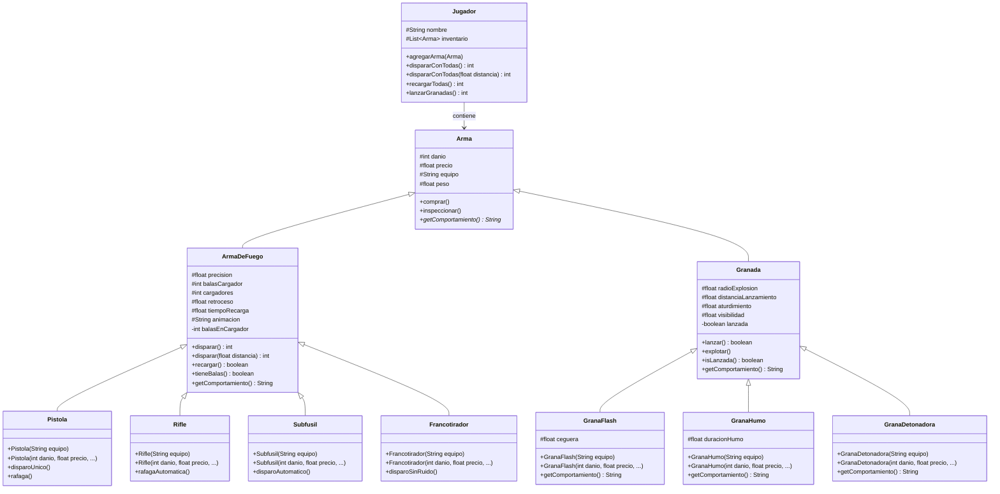

# LT-taller-git-2026

API REST de modelado de armas de Counter-Strike 2, implementada con Spring Boot. Demuestra herencia, sobreescritura, sobrecarga y ocultamiento de la información.

## Entrega

- **Commit de la solución:** https://github.com/LTP22/ltauber-tp-lp3-2026/commit/193defe61e8b58b1c35ba76d23bfd778c1ca3156
- **Commit de las especificaciones:** https://github.com/LTP22/ltauber-tp-lp3-2026/commit/ef134bb148861e1124902de772b6fa7b5bfe09e2
- **Bitácora de IA:** [BITACORA.md](BITACORA.md)
- **Especificaciones:** [ESPECIFICACIONES.md](ESPECIFICACIONES.md)

## Objetivo

Publicar un servicio HTTP que versiona el modelado de clases de CS2 y separa las reglas del dominio (`domain`) de la capa HTTP (`rest.controller`).

## Estructura de paquetes

Sigue el template de la cátedra (`py.edu.uc.lp3`):

```
py.edu.uc.lp3
├── Application                 arranque de Spring Boot
├── domain                      reglas del juego (Arma, Granada, Jugador, ...)
└── rest.controller             servicios REST (IndexController, ArmaController, JugadorController)
```

## Arquitectura

### Jerarquía de clases


```mermaid
classDiagram
    class Jugador {
        #String nombre
        #List~Arma~ inventario
        +agregarArma(Arma)
        +dispararConTodas() int
        +dispararConTodas(float distancia) int
        +recargarTodas() int
        +lanzarGranadas() int
    }

    class Arma {
        #int danio
        #float precio
        #String equipo
        #float peso
        +comprar()
        +inspeccionar()
        +getComportamiento()* String
    }

    class ArmaDeFuego {
        #float precision
        #int balasCargador
        #int cargadores
        #float retroceso
        #float tiempoRecarga
        #String animacion
        -int balasEnCargador
        +disparar() int
        +disparar(float distancia) int
        +recargar() boolean
        +tieneBalas() boolean
        +getComportamiento() String
    }

    class Pistola {
        +Pistola(String equipo)
        +Pistola(int danio, float precio, ...)
        +disparoUnico()
        +rafaga()
    }

    class Rifle {
        +Rifle(String equipo)
        +Rifle(int danio, float precio, ...)
        +rafagaAutomatica()
    }

    class Subfusil {
        +Subfusil(String equipo)
        +Subfusil(int danio, float precio, ...)
        +disparoAutomatico()
    }

    class Francotirador {
        +Francotirador(String equipo)
        +Francotirador(int danio, float precio, ...)
        +disparoSinRuido()
    }

    class Granada {
        #float radioExplosion
        #float distanciaLanzamiento
        #float aturdimiento
        #float visibilidad
        -boolean lanzada
        +lanzar() boolean
        +explotar()
        +isLanzada() boolean
        +getComportamiento() String
    }

    class GranaFlash {
        #float ceguera
        +GranaFlash(String equipo)
        +GranaFlash(int danio, float precio, ...)
        +getComportamiento() String
    }

    class GranaHumo {
        #float duracionHumo
        +GranaHumo(String equipo)
        +GranaHumo(int danio, float precio, ...)
        +getComportamiento() String
    }

    class GranaDetonadora {
        +GranaDetonadora(String equipo)
        +GranaDetonadora(int danio, float precio, ...)
        +getComportamiento() String
    }

    Jugador --> Arma : contiene
    Arma <|-- ArmaDeFuego
    Arma <|-- Granada
    ArmaDeFuego <|-- Pistola
    ArmaDeFuego <|-- Rifle
    ArmaDeFuego <|-- Subfusil
    ArmaDeFuego <|-- Francotirador
    Granada <|-- GranaFlash
    Granada <|-- GranaHumo
    Granada <|-- GranaDetonadora
```

## Sobreescritura y sobrecarga

### Sobreescritura

`Arma` declara el método abstracto `getComportamiento()`. Cada rama lo implementa con la misma firma y su propio cuerpo:

| Clase | Qué se agregó | Comportamiento devuelto |
|---|---|---|
| `Arma` | Método abstracto `getComportamiento()` | (contrato) |
| `ArmaDeFuego` | Implementación para la rama de armas de fuego | "Dispara con precision X y retroceso Y." |
| `Granada` | Implementación para la rama de granadas | "Se lanza a Xm y explota con radio Ym." |
| `GranaFlash`, `GranaHumo`, `GranaDetonadora` | Sobreescriben `getComportamiento()` de `Granada` | Texto específico de cada granada |

Se distingue por la firma idéntica y el cuerpo distinto. Cuál se ejecuta lo decide el tipo real del objeto en tiempo de ejecución: `ArmaController` declara `Arma`, pero devuelve `Pistola`, `GranaFlash`, etc.

### Sobrecarga

La sobrecarga usa el mismo nombre con distinta lista de parámetros. El compilador elige la versión según los argumentos.

| Clase | Sobrecarga | Diferencia |
|---|---|---|
| `Pistola`, `Rifle`, `Subfusil`, `Francotirador` | `(String equipo)` y `(int danio, float precio, ...)` | Constructor simple con valores legales por defecto, o completo con todos los atributos |
| `GranaFlash`, `GranaHumo`, `GranaDetonadora` | Igual que las armas de fuego | Idem |
| `ArmaDeFuego` | `disparar()` y `disparar(float distancia)` | Sin distancia equivale a disparar a quemarropa; con distancia el daño baja |
| `Jugador` | `dispararConTodas()` y `dispararConTodas(float distancia)` | Dispara todas las armas de fuego con balas, con o sin distancia |

Los constructores completos llaman a `super(...)` para inicializar la clase padre.

### Reglas del dominio

- Los constructores lanzan `IllegalArgumentException` con valores fuera de rango (daño negativo, equipo distinto de `T`/`CT`, precisión fuera de `[0, 1]`, cargador sin balas, etc.).
- `ArmaController` y `JugadorController` responden `400 Bad Request` con el motivo en el campo `error`.
- No hay setters públicos. El estado cambia solo por mensajes: `disparar()` consume una bala, `recargar()` gasta un cargador, `lanzar()` consume la granada.

## Endpoints

### IndexController
- `GET /` — Confirma que el servicio está vivo.

### ArmaController
Construye la instancia desde los parámetros de la URL. Todos los parámetros son opcionales y tienen valor por defecto.

- `GET /arma/pistola?danio=25&precio=500&equipo=T&precision=0.75&...`
- `GET /arma/rifle?danio=77&precio=2100&...`
- `GET /arma/subfusil?danio=20&precio=1200&...`
- `GET /arma/francotirador?danio=115&precio=4750&...`
- `GET /arma/granada-flash?danio=0&precio=200&...`
- `GET /arma/granada-humo?danio=0&precio=300&...`
- `GET /arma/granada-detonadora?danio=60&precio=400&...`

Ejemplo de respuesta con un valor inválido:

```
GET /arma/pistola?danio=-5  →  400  {"error":"El daño no puede ser negativo"}
```

### JugadorController
El inventario es en memoria. Los IDs son `1`, `2`, ... en orden de creación.

- `POST /jugador?nombre=Luis` — Crea un jugador.
- `POST /jugador/{id}/agregar-arma?tipo=pistola` — Agrega un arma. Tipos: `pistola`, `rifle`, `subfusil`, `francotirador`, `granada-flash`, `granada-humo`, `granada-detonadora`.
- `GET /jugador/{id}` — Muestra el inventario con el estado de cada arma.
- `POST /jugador/{id}/disparar` — Dispara todas las armas de fuego con balas.
- `POST /jugador/{id}/disparar?distancia=50` — Igual, pero aplicando la distancia (sobrecarga).
- `POST /jugador/{id}/recargar` — Recarga las armas de fuego.
- `POST /jugador/{id}/lanzar-granadas` — Lanza las granadas que todavía no se usaron.

## Polimorfismo en acción

El controller declara variables de tipo `Arma`, pero construye instancias concretas. El campo `comportamiento` del JSON sale del método sobreescrito de cada clase:

```json
{
  "danio": 25,
  "precio": 500.0,
  "equipo": "T",
  "peso": 1.5,
  "precision": 0.75,
  "balasCargador": 12,
  "balasEnCargador": 12,
  "cargadores": 3,
  "retroceso": 0.3,
  "tiempoRecarga": 0.5,
  "animacion": "pistol_fire",
  "comportamiento": "Dispara con precision 0.75 y retroceso 0.3."
}
```

## Conceptos implementados

- **Abstracción**: `Arma` y `Granada` son clases abstractas. `Arma` define el contrato `getComportamiento()`.
- **Herencia**: dos ramas independientes (`ArmaDeFuego`, `Granada`) y subclases concretas.
- **Sobreescritura**: `getComportamiento()` se implementa en cada rama y en las granadas específicas.
- **Sobrecarga**: constructores simples y completos; `disparar()` y `dispararConTodas()` con y sin distancia.
- **Encapsulamiento**: atributos `protected` en las clases base y `private` en el estado mutable; sin setters públicos.
- **Validación**: los constructores rechazan estados ilegales.

## Ejecución

1. Clonar el repositorio:
   ```bash
   git clone https://github.com/LTP22/ltauber-tp-lp3-2026.git
   cd ltauber-tp-lp3-2026
   ```

2. Ejecutar las pruebas y arrancar el servicio:
   ```bash
   ./mvnw test
   ./mvnw spring-boot:run
   ```

3. Probar los endpoints (en otra terminal; en PowerShell usar `curl.exe`, porque `curl` es un alias de `Invoke-WebRequest`):
   ```bash
   curl.exe http://localhost:8080/
   curl.exe http://localhost:8080/arma/pistola
   curl.exe -X POST "http://localhost:8080/jugador?nombre=Luis"
   ```

## Tecnologías

- **Java 21**
- **Spring Boot 4.1.1** (Spring Web)
- **Maven**

## Colaboración

Este proyecto fue desarrollado en colaboración con:

- **[agaona (ferue)](https://github.com/ferue)** — Desarrolló el sistema de tienda e inventario de venta en la rama `ltauber-contribucion-lp3` ([PR](https://github.com/ferue/agaona-taller-git-2026/pull/new/ltauber-contribucion-lp3))

La colaboración demuestra los principios de trabajo en equipo usando Git:
- Clonación de repositorios
- Creación de ramas de contribución
- Pull Requests para revisión de código
- Polimorfismo sin condicionales (`if`) en ambos proyectos

---

**Proyectos relacionados:**
- [ltauber-tp-lp3-2026](https://github.com/LTP22/ltauber-tp-lp3-2026) (este proyecto)
- [agaona-taller-git-2026](https://github.com/ferue/agaona-taller-git-2026) (repo del compañero)

## Licencia

Apache License 2.0

---

Entrega del Taller Git 2026 - Programación Orientada a Objetos (LP3)
Universidad Católica - Facultad de Ciencias y Tecnología
